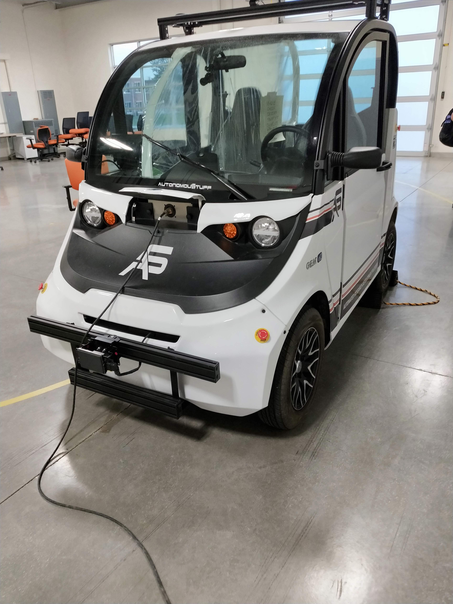

# Autonomous Vehicles

The repo contains the codes of my experience with autonomous vehicles as part of the [CS 598: Methods for Building Autonomous Vehicles](http://luthuli.cs.uiuc.edu/~daf/courses/MAAV-2020/598-2020-home.html) course, taught by [Prof. David Forsyth](http://luthuli.cs.uiuc.edu/~daf/).

## Requirements

All experiments are done on the vehicle platform by [AutonomousStuff](https://autonomoustuff.com/).



### Operating System

For development on my local machine, I installed ```Ubuntu 16.04``` subsystem on my ```Windows 10``` laptop. If you plan to do the same, then for ```RViz``` visualization/simulations, you may install ```XMing``` and/or ```VcXsrv```.

Apart from this, we need to install ROS (Robot Operating System) that provides the necessary support to interact with the autonomous vehicle and for simulations as well. I worked with ```ROS Kinetic``` ([Desktop-Full Installation](http://wiki.ros.org/kinetic/Installation/Ubuntu)).

### Libraries

I am using ```Python 2.7``` since found that its easily compatible with ROS Kinetic. Install OpenCV (```3.3.1-dev```):

```commandline
$ sudo apt-get install python-opencv
```

