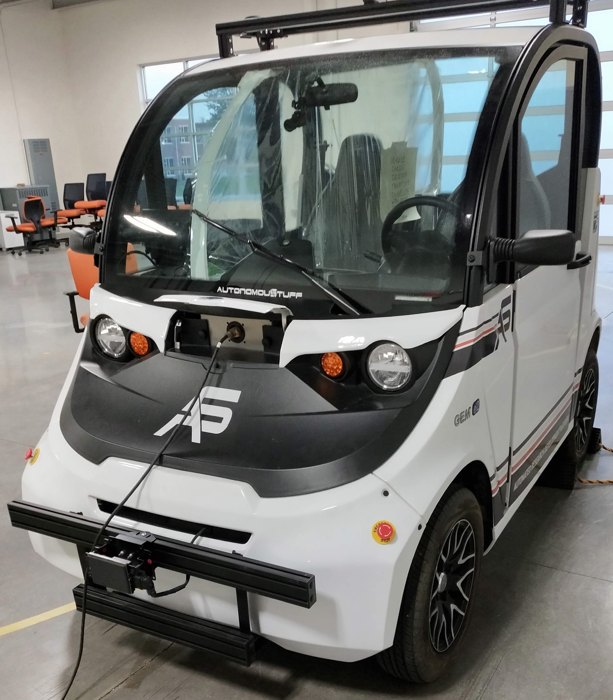

# Autonomous Vehicles

The repo contains the codes of my experience with autonomous vehicles as part of the [CS 598 MAAV: Methods for Building Autonomous Vehicles](http://luthuli.cs.uiuc.edu/~daf/courses/MAAV-2020/598-2020-home.html) course, taught by [Prof. David Forsyth](http://luthuli.cs.uiuc.edu/~daf/) at UIUC.

#### Homework 1 (Object Detection - ImageNet)

Pick any 10 ImageNet classes and pick 50 images from (1) ImageNet validation set, (2) image search results on Google or Bing. Compare the accuracy of a pretrained ResNet-18 model on these two and identify potential reasons for difference. Code: [homework1](homework1)

#### Challenge 1 (Brake on Detecting Pedestrian)

Cause the vehicle to brake after detecting a person. Code: [challenge1](challenge1)

#### Challenge 2 (SLAM)

Build a map of high bay using lidar and ros mapping software. Use a particle filter to localize in this map, using either lidar or vision. Code: [challenge2](challenge2)

#### Challenge 3 (Indoor and Outdoor SLAM)

Does Direct SLAM work better in an indoor area or outdoor area? Code: [challenge3](challenge3)

#### Project (Pedestrian Follower with PID control)

Program an AV to follow a selected person in its field of view by simultaneously tuning two PID controllers (to control steering angle and vehicle speed). The vehicle is allowed to accelerate, brake, reverse, steer, change gears. Code: [project](project)

More details on assignments and project work can be found in their respective directories.

## Requirements

All experiments are done on the vehicle platform by [AutonomousStuff](https://autonomoustuff.com/).



### Operating System

For development on my local machine, I installed ```Ubuntu 16.04``` subsystem on my ```Windows 10``` laptop. If you plan to do the same, then for ```RViz``` visualization/simulations, you may install ```XMing``` and/or ```VcXsrv```.

Apart from this, we need to install ROS (Robot Operating System) that provides the necessary support to interact with the autonomous vehicle and for simulations as well. I worked with ```ROS Kinetic``` ([Desktop-Full Installation](http://wiki.ros.org/kinetic/Installation/Ubuntu)). Install some basic ROS utils:

```commandline
$ sudo apt-get install ros-kinetic-rviz
$ sudo apt-get install ros-kinetic-roscd
```

### Libraries

I am using ```Python 2.7``` since found that its easily compatible with ROS Kinetic. Install OpenCV (```3.3.1-dev```):

```commandline
$ sudo apt-get install python-opencv
```

For libraries used in the code, you should be able to install them using ```apt-get``` following the example. For python package ```pacmod_msgs``` used as,
```python
import pacmod_msgs
```
Install using the following command:
```commandline
$ sudo apt-get install ros-kinetic-pacmod-msgs
```

**Note**: The ROS packages you install can be found in ```/opt/ros/kinetic/```. You might find the packages in ```share``` subdirectory within.  

### Collaborators

Thanks to our instructor, Prof. David Forsyth and my team members: 
* Amber Gupta
* Bhavana Jain
* Devansh Shah
* Keval Morabia
* Manav Mehra

### Contact

Happy to connect for discussions and details: 

```
Jatin Arora
jatin2@illinois.edu
jatinarora2702@gmail.com
```